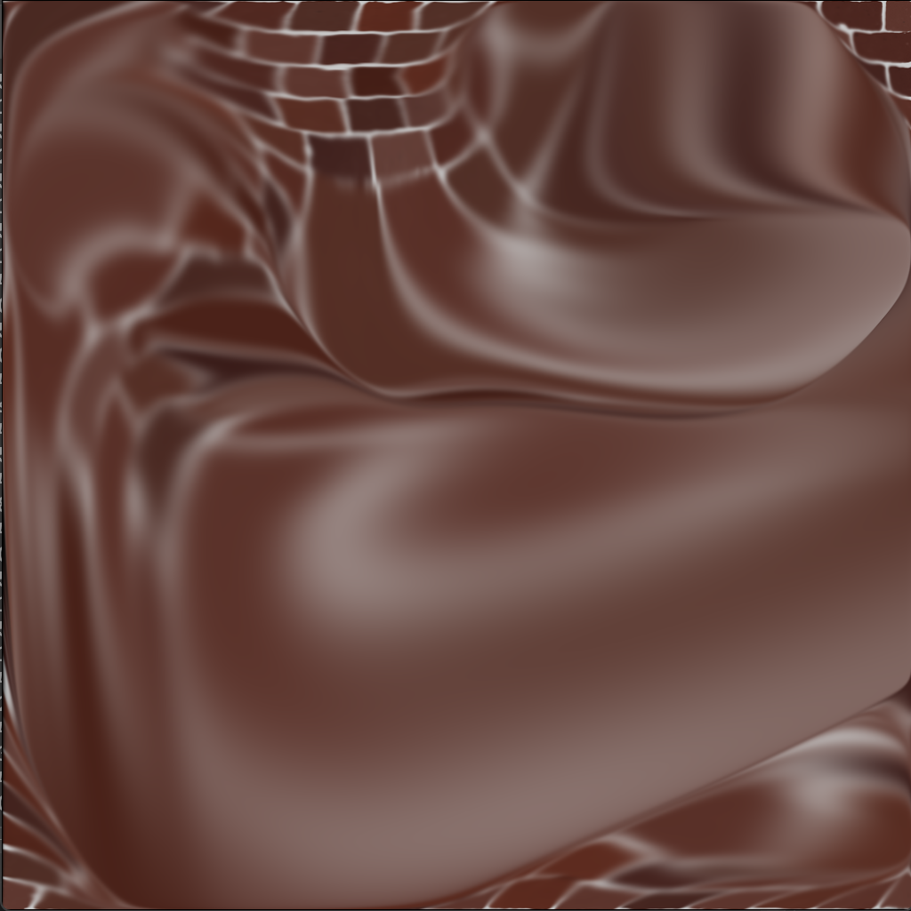

# 2D_Fluids
 An OpenGL OpenCL GPU implementation of 2D fluids. Interoperability is used to manipulate textures using OpenCL and render them on the framebuffer using OpenGL.\
 Based on: 
 - https://developer.nvidia.com/gpugems/gpugems/part-vi-beyond-triangles/chapter-38-fast-fluid-dynamics-simulation-gpu
 - https://dl.acm.org/doi/10.1145/311535.311548

## Build
Use CMake to build the solution. Everything should work by default.

## Customization
Various macros are used to alter the functionality of the implementation. They can be disabled or enabled in the "glitter.hpp" file.

## Use
You can switch between the rendered texture: dye (default), velocity, or pressure. You can use mouse clicks (hold click and drag) to add to the velocity and to the dye. Various controls are present in the GUI for you to add more force, normalize the direction of the force, and enable extreme mode (everything is added in the shape of a circle around the mouse position).\
Basic controls:
- Tab: enable/disable GUI
- G: enable/disable mouse click functionality
- M: Switch between adding velocity and adding dye
- R: Reset simulation
